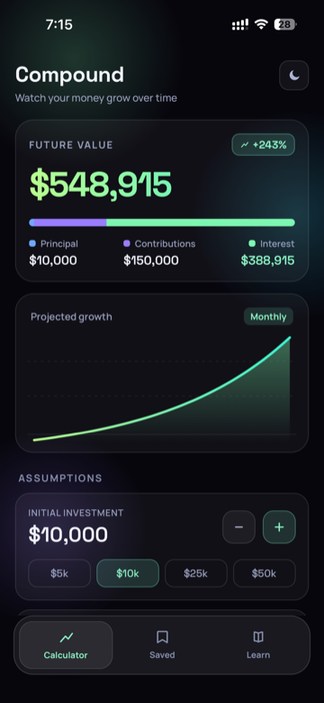
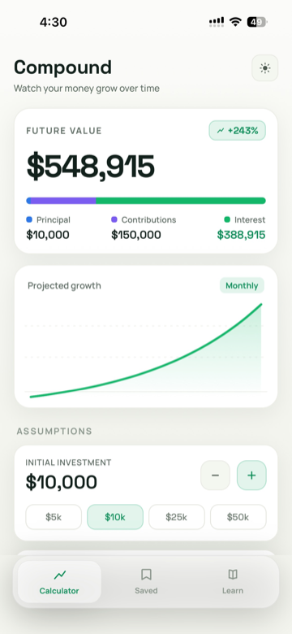
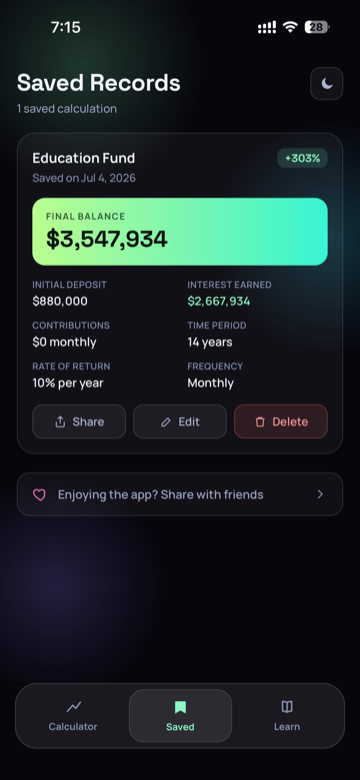
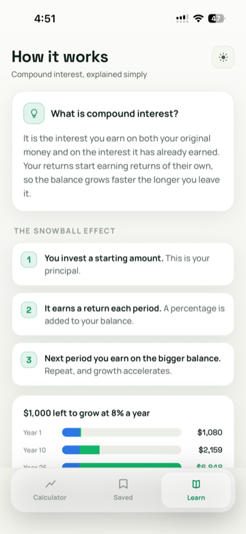

# Compound259

A compound interest calculator for iOS. Enter a starting amount, monthly contribution, rate, and time horizon, and see what your money grows into. Everything runs on the device. No accounts, no ads, no tracking.

**[Download on the App Store](https://apps.apple.com/us/app/compound259/id6757372216)**

## Screenshots

| Calculator (dark) | Calculator (light) | Saved records | Learn |
|:---:|:---:|:---:|:---:|
|  |  |  |  |

## Features

- Future value with regular contributions and annual, semi-annual, quarterly, or monthly compounding
- Growth chart that shows how the balance builds over the years
- Breakdown of principal, contributions, and interest earned
- Quick inputs with steppers and preset amounts, so there is no typing
- Save scenarios, compare them later, and share them as images
- Learn tab that explains compound interest in plain terms
- Dark and light themes

## Tech Stack

- [Expo](https://expo.dev) SDK 54 with React Native and TypeScript
- Expo Router for navigation
- AsyncStorage for on-device persistence
- react-native-svg for the chart

## Getting Started

```bash
npm install
npx expo start
```

Then press `i` for the iOS simulator, `a` for the Android emulator, or scan the QR code with a development build on a device.

## Release Build

Builds and App Store submission run through [EAS](https://docs.expo.dev/eas/):

```bash
npx eas build --platform ios --profile production --auto-submit
```

The production profile auto-increments the build number and submits to TestFlight.

## Project Structure

```
app/
  (tabs)/
    index.tsx     # Calculator screen
    explore.tsx   # Saved records screen
    learn.tsx     # Learn tab
  _layout.tsx     # Root layout
components/ui/    # Reusable UI components
constants/        # Design tokens and themes
hooks/            # Custom hooks
utils/            # Finance math and formatting
docs/screenshots/ # README images
```

## License

Private
